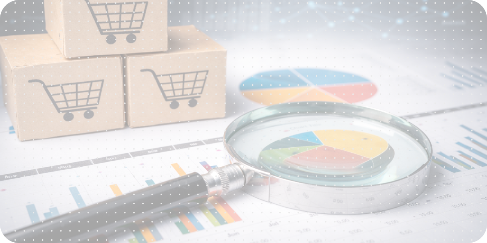
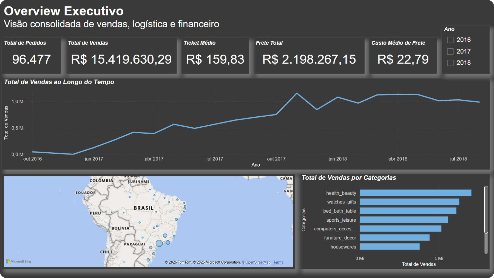
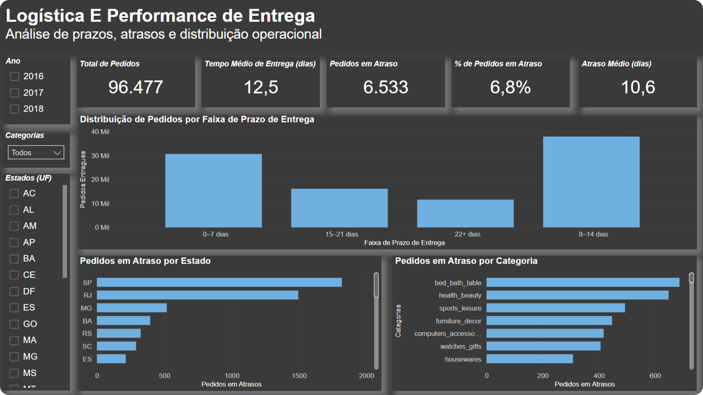
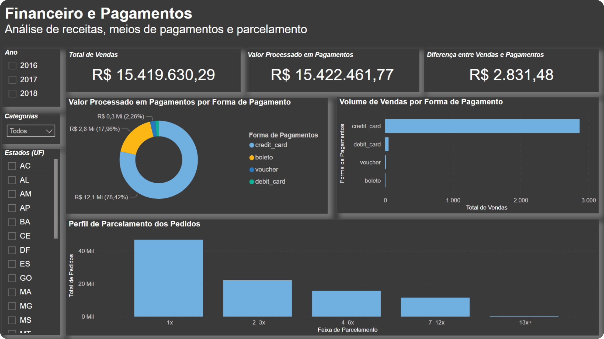

# RetailLens BI

**SQL Analytics para tomada de decisão em e-commerce com Power BI**



---

## Visão Geral

Esta Proof of Concept (POC) tem como objetivo demonstrar a construção de um **Business Intelligence executivo para e-commerce**, a partir de dados transacionais curados e modelados em SQL, com consumo direto em Power BI.

A POC simula um cenário real de atuação em times de dados, cobrindo desde a **curadoria estruturada dos dados** até a **entrega de dashboards gerenciais**, com foco em métricas claras, reprodutibilidade e separação adequada de responsabilidades entre dados e visualização.

O foco não é análise exploratória ou diagnóstico aprofundado, mas sim **visão executiva do negócio**, respondendo à pergunta:

> *“O que aconteceu com o e-commerce?”*

---

## Problema de Negócio

Operações de e-commerce geram grande volume de dados, mas frequentemente enfrentam desafios como:

* ausência de métricas consolidadas
* dashboards dependentes de lógica no BI
* inconsistência entre números reportados
* dificuldade de escalar análises operacionais

Esta POC demonstra como estruturar uma **camada analítica confiável (Gold)** que permita a construção de dashboards executivos simples, consistentes e defensáveis.

---

## Abordagem de Dados

A POC segue uma abordagem em camadas, alinhada a boas práticas de engenharia e analytics:

1. **Curadoria de Dados (Silver)**
   Padronização, validação e criação de views intermediárias a partir do dataset original.

2. **Camada Gold BI-Ready**
   Consolidação de dados operacionais, logísticos e financeiros em nível de pedido, com regras claras de negócio.

3. **Consumo em Power BI**
   Utilização da camada Gold como **fonte única da verdade**, sem lógica de transformação no dashboard.

---

## Dataset

* **Fonte:** [Olist E-commerce Dataset (Kaggle)](https://www.kaggle.com/datasets/olistbr/brazilian-ecommerce)
* **Contexto:** Marketplace brasileiro de e-commerce
* **Período:** 2016–2018

O dataset é utilizado exclusivamente como **meio demonstrativo**, sendo adaptado para uma arquitetura em camadas utilizando DuckDB.

---

### Ingestão de Dados

A ingestão e conversão dos dados brutos (CSV) para DuckDB foi realizada por meio de um script dedicado, mantido no repositório como **referência técnica e evidência de reprodutibilidade**.

O banco DuckDB versionado é considerado a **fonte oficial de dados** para esta POC.

---

## Estrutura do Projeto

```text
retaillens-bi/
│
├── data/
│   └── olist.duckdb
├── notebooks/
│   ├── 01_curadoria_sql.ipynb
│   └── 02_gold_ecommerce_executive_bi.ipynb
├── scripts/
│   └── ingest_olist_to_duckdb.py
├── src/
│   └── paths.py
├── dashboards/
│   └── retaillens_bi.pbix
├── imagens/
│   ├── thumbnail.jpg
│   ├── overview_dashboard.png
│   ├── logistics_dashboard.png
│   └── finance_dashboard.png
└── README.md
```
---

### Observação sobre os Notebooks

Os notebooks presentes neste repositório têm caráter **demonstrativo e documental**.  
Eles registram a lógica de curadoria, modelagem e construção da camada Gold, servindo como evidência do raciocínio analítico e das decisões técnicas adotadas.

A execução dos notebooks **não é necessária** para consumo dos dashboards, uma vez que a base DuckDB versionada já representa o estado final da curadoria de dados.

---

## Camada Gold - `gold_orders_enriched`

A camada Gold consolida informações em **nível de pedido**, com granularidade:

* **1 linha por pedido (`order_id`)**

### Conteúdo da Gold

* status e datas do pedido
* métricas logísticas (tempo de entrega, atraso)
* métricas financeiras (GMV, frete, pagamentos)
* dados do cliente (UF, cidade)
* categoria principal do pedido
* flags operacionais e financeiras para BI

### Características

* pronta para consumo direto no Power BI
* sem lógica analítica ou interpretativa
* métricas resolvidas em SQL
* estrutura pensada para KPIs, séries temporais e filtros simples

---

## Power BI - Entrega Executiva

O Power BI consome exclusivamente a view:

* `gold_orders_enriched` (DuckDB)

### Filtros padrão aplicados

* pedidos completos (`is_completed_order = 1`)
* pedidos com dados financeiros (`has_financials = 1`)

## Visão Geral dos Dashboards

A POC é composta por três dashboards principais, cada um com um objetivo claro:

### Overview Executivo
Visão consolidada de volume, receita, mix de categorias e distribuição geográfica.



### Logística
Análise de tempo de entrega, atraso, intensidade do atraso e concentração do problema por estado e categoria.



### Financeiro
Análise de recebimentos, formas de pagamento, parcelamento e gap entre GMV e valor efetivamente pago.



---

## Tecnologias Utilizadas

* SQL
* DuckDB
* Python
* Jupyter Notebook
* Power BI

---

## Decisões de Design

* grão único: 1 linha por pedido (`order_id`)
* métricas resolvidas integralmente em SQL na camada Gold
* Power BI utilizado exclusivamente para visualização
* separação explícita entre a POC **RetailLens BI** (executiva) e análises exploratórias fora do escopo desta entrega
* foco em clareza, consistência e leitura executiva

---

## Status

POC concluída — curadoria finalizada, camada Gold BI-ready construída e dashboard executivo funcional.

A etapa seguinte consiste em ajustes visuais e refinamento de layout.

---

## Licença

Este projeto está licenciado sob os termos da **MIT License**.
Consulte o arquivo `LICENSE` para mais detalhes.

---

## Disclaimer

Este projeto é uma **Proof of Concept (POC)** desenvolvida com o objetivo de **demonstrar capacidade técnica e visão analítica aplicada a problemas reais de negócio**, utilizando ferramentas, métodos e práticas comuns em ambientes profissionais de dados.

As análises, visualizações, conclusões e recomendações apresentadas têm caráter **demonstrativo** e **não devem ser interpretadas como direcionamento operacional real**, nem como base direta para tomada de decisão em ambiente produtivo.

Esta POC **não foi desenvolvida para uso em produção.**

---

## Contato

**Jhonathan Domingues**

🌐 [Portifólio](https://jhonathan.me) | 💼 [Linkedin](https://www.linkedin.com/in/jhonathandomingues)
