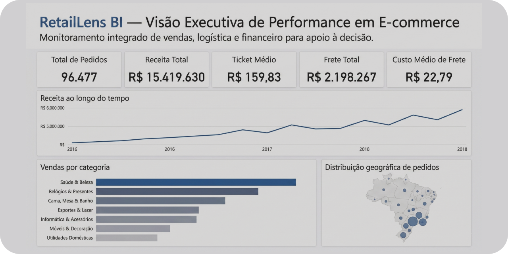
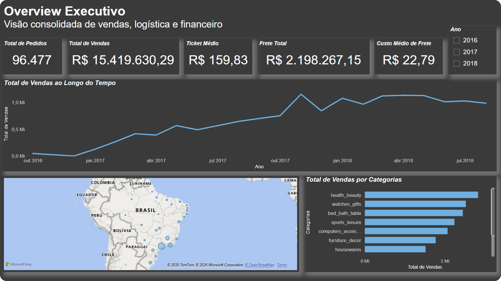
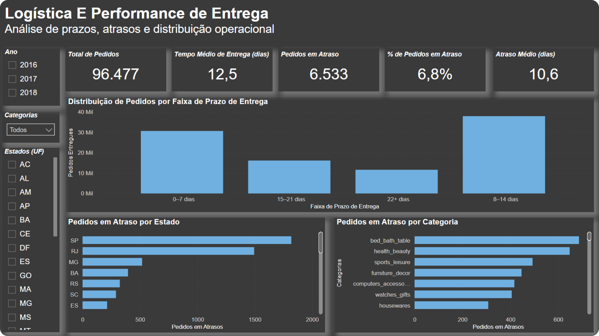
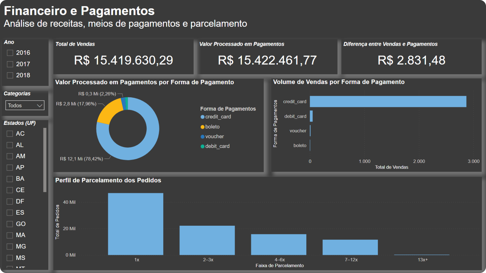

# RetailLens BI

**Camada analítica BI-ready em SQL para dashboards executivos de e-commerce.**




---

# Visão Geral

A **RetailLens BI** é uma **Proof of Concept (POC)** que demonstra a construção de uma **camada analítica BI-ready em SQL** para suporte à tomada de decisão em operações de e-commerce.

O projeto simula um cenário comum em times de dados: transformar dados operacionais brutos em uma **estrutura analítica consistente**, capaz de alimentar dashboards executivos sem dependência de lógica no BI.

A POC cobre todo o fluxo:

```text
dados operacionais → curadoria SQL → camada Gold analítica → dashboards executivos
```

O objetivo é demonstrar como uma modelagem analítica bem estruturada permite construir **dashboards simples, confiáveis e escaláveis**.

---

# Problema de Negócio

Operações de e-commerce produzem grande volume de dados operacionais, mas frequentemente enfrentam problemas como:

* métricas inconsistentes entre dashboards
* lógica de negócio implementada diretamente no BI
* dificuldade de reproduzir números reportados
* dashboards difíceis de escalar ou manter

A **RetailLens BI** demonstra como estruturar uma **camada analítica centralizada**, capaz de servir como **fonte única da verdade para consumo executivo**.

---

# Abordagem da Solução

A solução segue uma arquitetura em camadas, separando claramente organização de dados e visualização.

### Curadoria de Dados (Silver)

* padronização do dataset original
* criação de views intermediárias
* consolidação de dados operacionais

---

### Camada Gold Analítica

* consolidação de métricas em nível de pedido
* resolução de regras de negócio em SQL
* criação de estrutura preparada para consumo analítico

Essa camada funciona como **fonte única de dados para os dashboards executivos**.

---

### Consumo no Power BI

O Power BI consome diretamente a view:

```
gold_orders_enriched
```

Nenhuma transformação é realizada no dashboard, garantindo consistência entre visualizações e métricas.

---

# Tecnologias Utilizadas

* SQL
* DuckDB
* Python
* Jupyter Notebook
* Power BI

---

# Arquitetura Analítica

A modelagem analítica segue um princípio simples:

```text
dados operacionais
      ↓
curadoria SQL
      ↓
camada Gold analítica
      ↓
dashboards executivos
```

A tabela principal da camada Gold possui granularidade:

```
1 linha por pedido (order_id)
```

Ela consolida:

* métricas logísticas
* métricas financeiras
* dados de cliente
* categoria principal do pedido
* indicadores operacionais e financeiros

Essa estrutura permite criar dashboards executivos sem lógica adicional no BI.

---

# Estrutura do Projeto

```text
retaillens-bi/

├── data/
│   └── olist.duckdb
│
├── notebooks/
│   ├── 01_curadoria_sql.ipynb
│   └── 02_gold_ecommerce_executive_bi.ipynb
│
├── scripts/
│   └── ingest_olist_to_duckdb.py
│
├── src/
│   └── paths.py
│
├── dashboards/
│   └── retaillens_bi.pbix
│
├── imagens/
│   ├── thumbnail.jpg
│   ├── overview_dashboard.png
│   ├── logistics_dashboard.png
│   └── finance_dashboard.png
│
└── README.md
```

Os notebooks documentam a lógica de curadoria e construção da camada Gold.

A execução deles **não é necessária para visualizar os dashboards**, pois o banco DuckDB versionado já contém o estado final da modelagem analítica.

---

# Dashboards

A POC apresenta três dashboards executivos construídos sobre a camada Gold.

---

## Overview Executivo



Visão consolidada de volume de pedidos, receita, mix de categorias e distribuição geográfica das vendas.

---

## Logística



Análise de tempo de entrega, intensidade do atraso e concentração do problema por estado e categoria.

---

## Financeiro



Análise de pagamentos, parcelamento e diferença entre GMV e valor efetivamente recebido.

---

# Resultados

A RetailLens BI demonstra como estruturar dados operacionais para consumo analítico consistente.

A POC entrega:

* camada analítica BI-ready construída em SQL
* modelo com granularidade consistente (1 linha por pedido)
* métricas resolvidas na camada de dados
* dashboards executivos alimentados por uma única fonte analítica
* separação clara entre dados e visualização

---

# Status

**POC concluída**

* curadoria de dados finalizada
* camada Gold analítica construída
* dashboards executivos funcionais

---

# Disclaimer

Este projeto é uma **Proof of Concept (POC)** desenvolvida com fins demonstrativos.

As análises e visualizações apresentadas têm caráter ilustrativo e não devem ser utilizadas diretamente como base para decisões operacionais em ambiente produtivo.

---

# Explore outros projetos do Small Data Lab

Este projeto faz parte do **Small Data Lab**, um laboratório técnico dedicado à experimentação aplicada em dados, analytics e sistemas de IA.

Explore também outras POCs do laboratório:

- [LakeFlow](https://github.com/smalldatalabbr/lakeflow) — Pipeline Lakehouse para ingestão e organização de dados externos.  
- [DelayImpact](https://github.com/smalldatalabbr/delayimpact-analytics) — Análise que investiga o impacto de atrasos logísticos na satisfação do cliente. 
- [CampaignSense](https://github.com/smalldatalabbr/campaignsense) — CRM Analytics para priorização de campanhas baseada em propensão e ROI.  
- [FraudWatch](https://github.com/smalldatalabbr/fraudwatch) — Sistema de decisão antifraude que transforma scores de ML em políticas operacionais auditáveis.  
- [DocLens](https://github.com/smalldatalabbr/doclens) — Chatbot RAG com guardrails e testes adversariais para governança de LLMs.

---

## Onde me encontrar

[Portfólio](https://jhonathan.me) | [LinkedIn](https://www.linkedin.com/in/jhonathandomingues) | [Email](mailto:hello@jhonathan.me)

---

Este repositório é licenciado sob a MIT License.